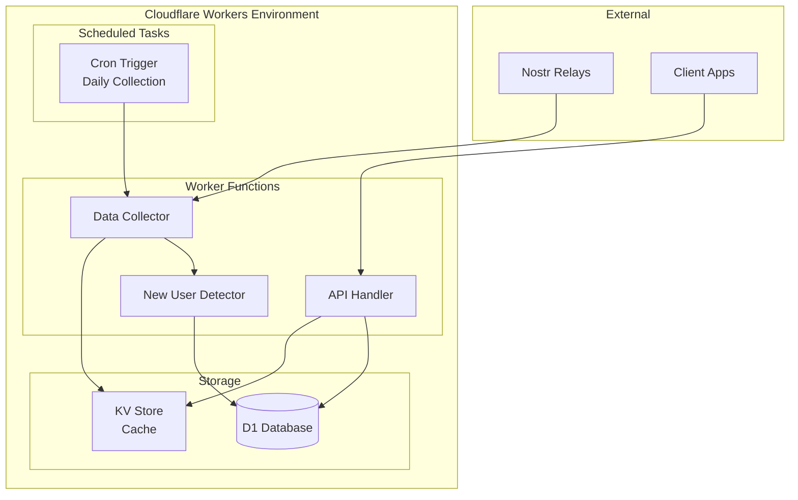
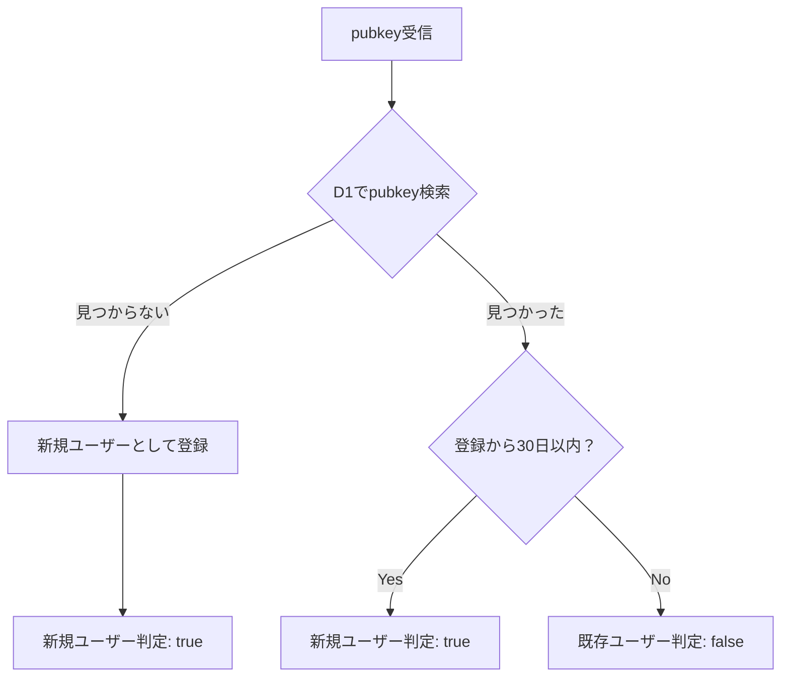
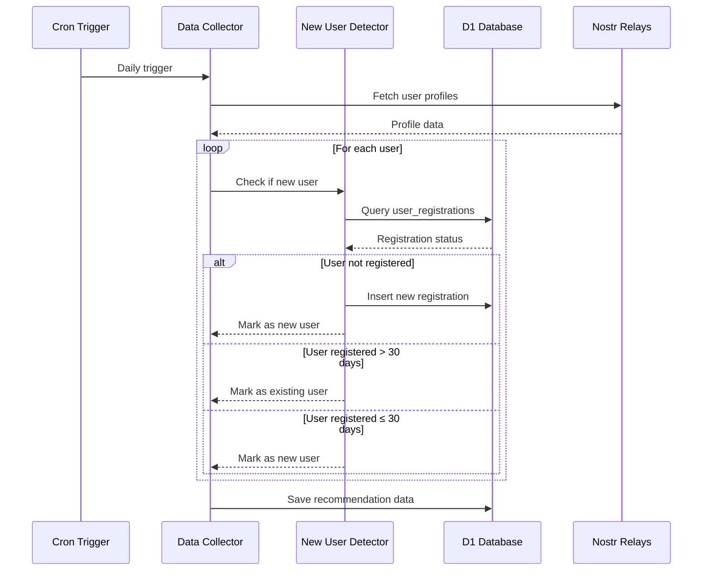

# Cloudflare Workers新規ユーザー検出システム設計書

## 📋 プロジェクト概要

現在のNode.js + Express + JSONファイルベースのシステムを、Cloudflare Workers + D1データベースに移行し、pubkeyベースの新規ユーザー検出機能を追加します。

### 🎯 主要目標
- pubkeyによる確実なユーザー追跡
- 30日以内の新規登録者判定
- Cloudflare Workersでの高性能・低コスト運用
- 既存機能の完全移行

## 🗄️ データベース設計 (Cloudflare D1)

### テーブル設計

```sql
-- ユーザー登録追跡テーブル
CREATE TABLE user_registrations (
    pubkey TEXT PRIMARY KEY,           -- ユーザーの公開鍵（hex形式）
    first_seen_at INTEGER NOT NULL,   -- 初回検出日時（Unix timestamp）
    created_at INTEGER NOT NULL       -- レコード作成日時（Unix timestamp）
);

-- インデックス作成（検索性能向上）
CREATE INDEX idx_first_seen_at ON user_registrations(first_seen_at);
```

### データ例

```json
{
  "pubkey": "a1b2c3d4e5f6...",
  "first_seen_at": 1704067200,
  "created_at": 1704067200
}
```

## 🏗️ システムアーキテクチャ



## 🔧 主要機能設計

### 1. 新規ユーザー検出ロジック

```typescript
interface NewUserDetector {
  // 新規ユーザーかどうかを判定
  isNewUser(pubkey: string): Promise<boolean>;

  // ユーザーを登録（初回検出時）
  registerUser(pubkey: string, firstSeenAt: number): Promise<void>;

  // 30日以内の新規ユーザー一覧を取得
  getNewUsers(): Promise<string[]>;

  // 古い登録データをクリーンアップ
  cleanupOldRegistrations(): Promise<void>;
}
```

### 2. 新規ユーザー判定フロー



### 3. データ収集フロー



## 📁 プロジェクト構造

```
nostr-toss-up-workers/
├── src/
│   ├── index.ts              # Worker entry point
│   ├── handlers/
│   │   ├── api.ts           # API request handlers
│   │   └── cron.ts          # Scheduled task handlers
│   ├── services/
│   │   ├── collector.ts     # Data collection service
│   │   ├── detector.ts      # New user detection service
│   │   └── database.ts      # D1 database operations
│   ├── types/
│   │   └── index.ts         # TypeScript type definitions
│   └── utils/
│       └── helpers.ts       # Utility functions
├── migrations/
│   └── 0001_initial.sql     # D1 database schema
├── wrangler.toml            # Cloudflare Workers configuration
├── package.json
└── tsconfig.json
```

## 🚀 実装ステップ

### Phase 1: 基盤構築
1. **Cloudflare Workers プロジェクト初期化**
   - [ ] `wrangler.toml` 設定
   - [ ] D1データベース作成・設定
   - [ ] 基本的なWorker構造作成
   - [ ] TypeScript設定

2. **データベーススキーマ実装**
   - [ ] `user_registrations` テーブル作成
   - [ ] マイグレーションスクリプト作成
   - [ ] インデックス設定

### Phase 2: 新規ユーザー検出機能
1. **NewUserDetector サービス実装**
   - [ ] pubkey登録・検索機能
   - [ ] 30日判定ロジック
   - [ ] データクリーンアップ機能
   - [ ] エラーハンドリング

2. **データベース操作層実装**
   - [ ] D1クエリ関数
   - [ ] バッチ処理機能
   - [ ] パフォーマンス最適化

### Phase 3: データ収集システム移行
1. **既存Collectorの移植**
   - [ ] nostr-tools統合
   - [ ] Workers環境対応
   - [ ] 新規ユーザー検出統合
   - [ ] 日本語ユーザーフィルタリング

2. **Cron Job実装**
   - [ ] 定期実行設定（1日1回）
   - [ ] エラー処理・リトライ機能
   - [ ] ログ出力機能

### Phase 4: API実装
1. **REST API エンドポイント**
   - [ ] `GET /users` - 推薦ユーザー取得
   - [ ] `GET /posts` - 推薦投稿取得
   - [ ] `GET /health` - ヘルスチェック
   - [ ] CORS設定

2. **キャッシュ機能**
   - [ ] KV Storeを使用したレスポンスキャッシュ
   - [ ] 適切なTTL設定
   - [ ] キャッシュ無効化機能

## 🛠️ 技術仕様

### 新規ユーザー判定アルゴリズム

```typescript
class NewUserDetector {
  private db: D1Database;

  async isNewUser(pubkey: string): Promise<boolean> {
    // 1. データベースから登録情報を検索
    const registration = await this.db
      .prepare('SELECT first_seen_at FROM user_registrations WHERE pubkey = ?')
      .bind(pubkey)
      .first();

    if (!registration) {
      // 2. 未登録の場合は新規ユーザーとして登録
      const now = Math.floor(Date.now() / 1000);
      await this.registerUser(pubkey, now);
      return true;
    }

    // 3. 30日以内かどうかを判定
    const thirtyDaysAgo = Math.floor(Date.now() / 1000) - (30 * 24 * 60 * 60);
    return registration.first_seen_at > thirtyDaysAgo;
  }

  async registerUser(pubkey: string, firstSeenAt: number): Promise<void> {
    await this.db
      .prepare('INSERT INTO user_registrations (pubkey, first_seen_at, created_at) VALUES (?, ?, ?)')
      .bind(pubkey, firstSeenAt, Math.floor(Date.now() / 1000))
      .run();
  }

  async getNewUsers(): Promise<string[]> {
    const thirtyDaysAgo = Math.floor(Date.now() / 1000) - (30 * 24 * 60 * 60);
    const results = await this.db
      .prepare('SELECT pubkey FROM user_registrations WHERE first_seen_at > ? ORDER BY first_seen_at DESC')
      .bind(thirtyDaysAgo)
      .all();

    return results.results.map(row => row.pubkey as string);
  }

  async cleanupOldRegistrations(): Promise<void> {
    const sixtyDaysAgo = Math.floor(Date.now() / 1000) - (60 * 24 * 60 * 60);
    await this.db
      .prepare('DELETE FROM user_registrations WHERE first_seen_at < ?')
      .bind(sixtyDaysAgo)
      .run();
  }
}
```

### パフォーマンス最適化

1. **バッチ処理**
   ```typescript
   async checkMultipleUsers(pubkeys: string[]): Promise<Map<string, boolean>> {
     const results = new Map<string, boolean>();

     // バッチでクエリ実行
     const placeholders = pubkeys.map(() => '?').join(',');
     const registrations = await this.db
       .prepare(`SELECT pubkey, first_seen_at FROM user_registrations WHERE pubkey IN (${placeholders})`)
       .bind(...pubkeys)
       .all();

     // 結果処理
     const thirtyDaysAgo = Math.floor(Date.now() / 1000) - (30 * 24 * 60 * 60);
     const registeredUsers = new Set(registrations.results.map(r => r.pubkey));

     for (const pubkey of pubkeys) {
       if (!registeredUsers.has(pubkey)) {
         results.set(pubkey, true); // 新規ユーザー
       } else {
         const registration = registrations.results.find(r => r.pubkey === pubkey);
         results.set(pubkey, registration.first_seen_at > thirtyDaysAgo);
       }
     }

     return results;
   }
   ```

2. **キャッシュ戦略**
   - 新規ユーザーリストのKVキャッシュ（TTL: 1時間）
   - 推薦データのキャッシュ（TTL: 6時間）
   - ユーザー判定結果のキャッシュ（TTL: 30分）

3. **データベース最適化**
   - 適切なインデックス設定
   - 古いデータの定期削除（60日以上）
   - クエリの最適化

## 🔄 移行戦略

### 1. 段階的移行
1. **Phase 1**: 新規ユーザー検出機能のみ実装・テスト
2. **Phase 2**: 既存データ収集機能の移植
3. **Phase 3**: API機能の移植
4. **Phase 4**: 本番環境への完全移行

### 2. データ移行
```typescript
// 既存JSONデータからD1への移行スクリプト
async function migrateExistingData() {
  // 既存のusers.jsonから推薦ユーザーを取得
  const existingUsers = await readExistingUsersData();

  // 新規ユーザーをD1に登録
  for (const user of existingUsers.filter(u => u.reason === 'new_user')) {
    const pubkeyHex = nip19.decode(user.pubkey).data;
    const createdAt = new Date(user.createdAt).getTime() / 1000;
    await detector.registerUser(pubkeyHex, createdAt);
  }
}
```

## 🔒 セキュリティ・運用考慮事項

### 1. セキュリティ
- **レート制限**: API呼び出し制限（100req/min/IP）
- **入力検証**: pubkey形式の厳密な検証
- **SQLインジェクション対策**: Prepared Statements使用

### 2. エラーハンドリング
```typescript
class ErrorHandler {
  static handleDatabaseError(error: Error): Response {
    console.error('Database error:', error);
    return new Response('Internal Server Error', { status: 500 });
  }

  static handleRelayError(error: Error): void {
    console.error('Relay connection error:', error);
    // フォールバック処理
  }
}
```

### 3. モニタリング
- Workers Analytics使用
- カスタムメトリクス設定
- アラート設定（エラー率、レスポンス時間）

### 4. ログ出力
```typescript
interface LogEntry {
  timestamp: string;
  level: 'info' | 'warn' | 'error';
  message: string;
  metadata?: any;
}

class Logger {
  static info(message: string, metadata?: any): void {
    console.log(JSON.stringify({
      timestamp: new Date().toISOString(),
      level: 'info',
      message,
      metadata
    }));
  }
}
```

## 📊 期待される効果

### 1. 機能面
- **正確な新規ユーザー判定**: pubkeyベースの確実な追跡
- **重複排除の完全性**: データベースによる一意性保証
- **高速な判定処理**: インデックス最適化による高速クエリ

### 2. 運用面
- **スケーラビリティ**: Cloudflare Workersの自動スケーリング
- **低コスト**: サーバーレス環境での従量課金
- **高可用性**: Cloudflareのグローバルネットワーク

### 3. 開発・保守面
- **低メンテナンス**: サーバー管理不要
- **自動バックアップ**: D1の自動バックアップ機能
- **簡単なデプロイ**: Wranglerによる簡単デプロイ

## 🎯 成功指標

1. **機能指標**
   - 新規ユーザー検出精度: 95%以上
   - API応答時間: 200ms以下
   - データベースクエリ時間: 50ms以下

2. **運用指標**
   - 稼働率: 99.9%以上
   - エラー率: 1%以下
   - 月間コスト: 現在の50%以下

## 📝 次のアクション

1. **即座に開始**
   - Cloudflare Workersプロジェクト作成
   - D1データベース設定
   - 基本的なWorker構造実装

2. **優先実装**
   - NewUserDetector サービス
   - データベース操作層
   - 基本的なテスト

3. **段階的展開**
   - 機能ごとの段階的実装
   - 各段階でのテスト・検証
   - 本番環境への段階的移行

---

この設計書に基づいて、Cloudflare Workers環境での新規ユーザー検出システムを実装していきます。
