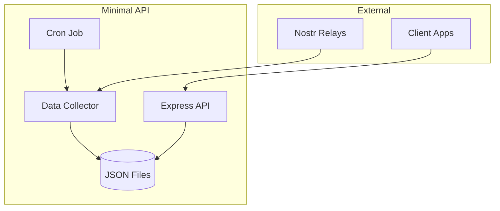
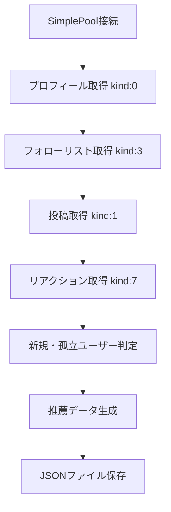

# Nostr投稿推薦API設計書

## 📋 プロジェクト概要

- **目的**: 新規ユーザーや孤立したユーザーの投稿を推薦するAPI提供
- **対象**: 始めたての人や、続けているけどソーシャルグラフ的に孤立している人
- **技術スタック**: Node.js + Express + TypeScript + JSON ファイル
- **データ保存**: ローカルJSONファイル

## 🏗️ システムアーキテクチャ



## 🗄️ データ構造

### `data/users.json`
推薦対象ユーザーの情報を保存

```json
{
  "recommendedUsers": [
    {
      "pubkey": "npub1abc123...",
      "reason": "new_user",
      "createdAt": "2025-06-01T10:00:00Z"
    },
    {
      "pubkey": "npub1def456...",
      "reason": "isolated_user",
      "followerCount": 12
    }
  ],
  "lastUpdated": "2025-06-03T12:00:00Z"
}
```

### `data/posts.json`
推薦投稿の情報を保存

```json
{
  "recommendedPosts": [
    {
      "nevent": "nevent1xyz789...",
      "authorPubkey": "npub1abc123...",
      "createdAt": "2025-06-03T10:00:00Z",
      "reason": "from_new_user"
    },
    {
      "nevent": "nevent1uvw012...",
      "authorPubkey": "npub1def456...",
      "createdAt": "2025-06-03T09:00:00Z",
      "reason": "from_isolated_user"
    }
  ],
  "lastUpdated": "2025-06-03T12:00:00Z"
}
```

## 🚀 API設計

### エンドポイント1: 推薦ユーザー取得

**URL**: `GET /users`

**レスポンス例**:
```json
{
  "users": [
    {
      "pubkey": "npub1abc123...",
      "reason": "new_user"
    },
    {
      "pubkey": "npub1def456...",
      "reason": "isolated_user"
    }
  ],
  "count": 2,
  "lastUpdated": "2025-06-03T12:00:00Z"
}
```

### エンドポイント2: 推薦投稿取得

**URL**: `GET /posts`

**レスポンス例**:
```json
{
  "posts": [
    {
      "nevent": "nevent1xyz789...",
      "authorPubkey": "npub1abc123...",
      "reason": "from_new_user"
    },
    {
      "nevent": "nevent1uvw012...",
      "authorPubkey": "npub1def456...",
      "reason": "from_isolated_user"
    }
  ],
  "count": 2,
  "lastUpdated": "2025-06-03T12:00:00Z"
}
```

## 🔧 主要機能

### 1. データ収集システム
- **実行頻度**: 1日1回（cron job）
- **データソース**: Nostrリレーサーバー
- **処理内容**:
  - ユーザー情報の収集
  - 新規ユーザー判定（アカウント作成から30日以内）
  - 孤立ユーザー判定（フォロワー数が少ない、エンゲージメントが低い）
  - 対象ユーザーの投稿収集

### 2. 推薦ロジック
- **新規ユーザー**: アカウント作成から一定期間内のユーザー
- **孤立ユーザー**: ソーシャルグラフ分析で孤立していると判定されたユーザー
- **投稿選定**: 対象ユーザーの最新投稿を時系列でソート

### 3. API サーバー
- **フレームワーク**: Express.js
- **データ読み込み**: JSONファイルから直接読み込み
- **レスポンス**: シンプルなJSON形式

## 📁 プロジェクト構造

```
nostr-toss-up/
├── src/
│   ├── server.ts      # Express サーバーのメインファイル
│   ├── collector.ts   # データ収集ロジック
│   ├── routes/
│   │   ├── users.ts   # ユーザー推薦APIルート
│   │   └── posts.ts   # 投稿推薦APIルート
│   └── types.ts       # TypeScript型定義
├── data/              # JSON データファイル
│   ├── users.json     # 推薦ユーザーデータ
│   └── posts.json     # 推薦投稿データ
├── scripts/           # 定期実行スクリプト
│   └── collect.ts     # データ収集スクリプト
├── package.json       # Node.js依存関係
├── tsconfig.json      # TypeScript設定
└── DESIGN.md          # この設計書
```

## ⚡ 使用方法

### サーバー起動
```bash
npm start
```

### データ収集（手動実行）
```bash
npm run collect
```

### API呼び出し例
```bash
# 推薦ユーザー取得
curl http://localhost:3000/users

# 推薦投稿取得
curl http://localhost:3000/posts
```

## 🔄 運用フロー

1. **定期データ収集**: cron jobで1日1回データ収集スクリプトを実行
2. **データ更新**: 新規・孤立ユーザーと投稿情報をJSONファイルに保存
3. **API提供**: クライアントアプリからのリクエストに対してJSONデータを返却

## 🔧 nostr-tools実装詳細

### リレー接続とデータ取得

```typescript
import { SimplePool } from 'nostr-tools/pool'
import { finalizeEvent, generateSecretKey, getPublicKey } from 'nostr-tools'

// リレー設定
const relays = [
  'wss://relay.damus.io',
  'wss://nos.lol',
  'wss://relay.snort.social',
  'wss://relay.nostr.band'
]

// SimplePoolでリレー接続
const pool = new SimplePool()

// プロフィール情報取得 (kind: 0)
const profiles = await pool.list(relays, [{ kinds: [0] }])

// テキスト投稿取得 (kind: 1)
const posts = await pool.list(relays, [{ kinds: [1], limit: 100 }])
```

### 新規・孤立ユーザー判定ロジック

1. **新規ユーザー判定**:
   - プロフィール作成日時 (kind: 0 の created_at) から30日以内
   - フォロワー数が少ない (kind: 3 のフォローリスト解析)

2. **孤立ユーザー判定**:
   - フォロワー数50未満
   - 最近の投稿へのリアクション (kind: 7) が少ない
   - リプライ (kind: 1 with e tags) が少ない

### データ収集フロー



## � 実装ステップ

### ✅ 完了済み
1. **基本プロジェクト構造の作成**
2. **TypeScript設定とパッケージ依存関係の設定**
3. **Express APIサーバーの実装**
4. **モックデータでの動作確認**

### 🔄 次のステップ (nostr-tools統合)
1. **nostr-tools/poolの追加依存関係**
2. **リレー接続ロジックの実装**
3. **プロフィール・投稿データ取得**
4. **新規・孤立ユーザー判定アルゴリズム**
5. **実データでの動作確認**

---

この設計書に基づいて、nostr-toolsを使った実装に進みます。
