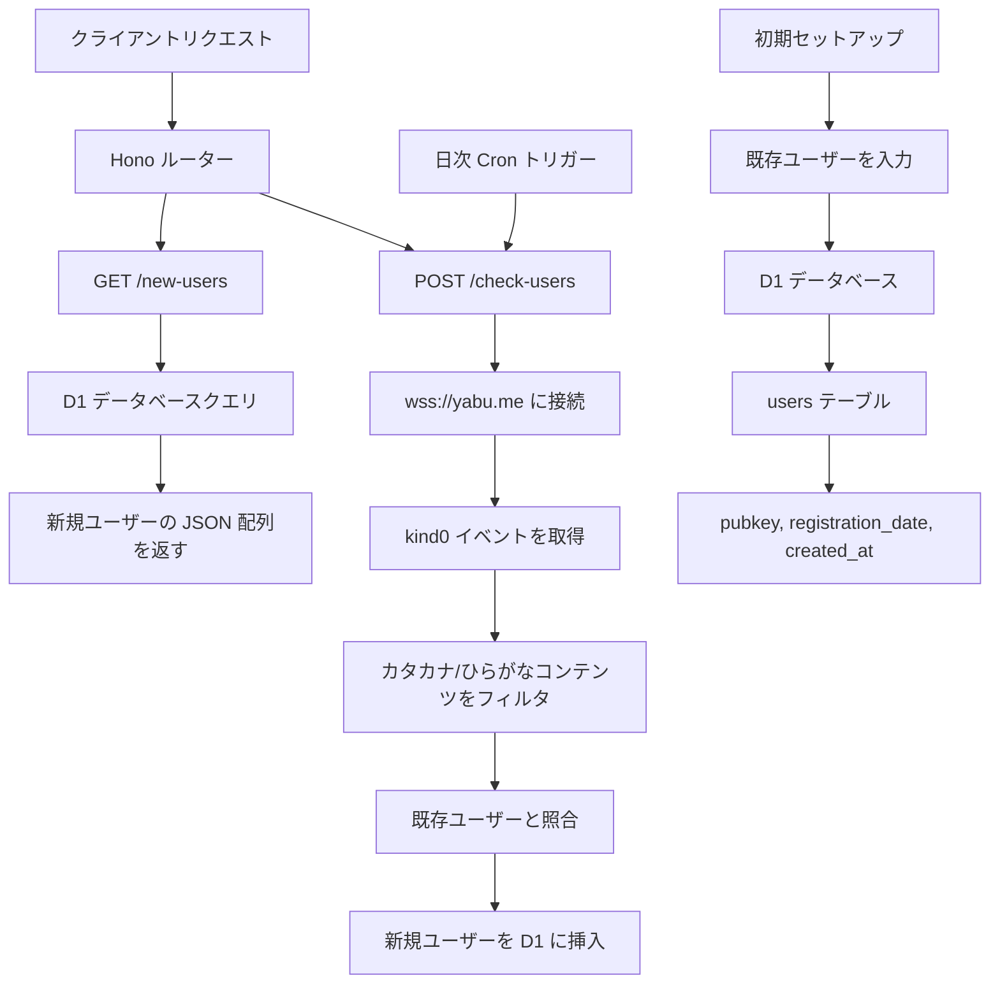

# Nostr 新規ユーザー API 実装計画

## 概要
Hono + Cloudflare Workers と D1 データベースを使用した Nostr 新規ユーザー追跡 API を作成します：
- カタカナ/ひらがなコンテンツを含む kind0 イベントを投稿するユーザーを追跡
- 過去30日以内に登録された新規ユーザーを返す
- 自動日次チェックと手動トリガーの両方を使用
- `src/existing-user.txt` から既存ユーザーを事前入力

## アーキテクチャ図



## データベーススキーマ

```sql
-- D1 データベーススキーマ
CREATE TABLE users (
  id INTEGER PRIMARY KEY AUTOINCREMENT,
  pubkey TEXT UNIQUE NOT NULL,
  registration_date DATE NOT NULL,
  created_at DATETIME DEFAULT CURRENT_TIMESTAMP
);

CREATE INDEX idx_registration_date ON users(registration_date);
CREATE INDEX idx_pubkey ON users(pubkey);
```

## API エンドポイント

### 1. GET `/new-users`
- **目的**: 過去30日以内に登録された新規ユーザーを返す
- **レスポンス**: pubkey のシンプルな JSON 配列
- **レスポンス例**:
```json
[
  "npub1abc123...",
  "npub1def456...",
  "npub1ghi789..."
]
```

### 2. POST `/check-users`
- **目的**: Nostr リレーから新規ユーザーをチェックする手動トリガー
- **レスポンス**: ステータスと新規追加ユーザー数
- **レスポンス例**:
```json
{
  "status": "success",
  "new_users_added": 5,
  "checked_at": "2025-06-09T13:44:00Z"
}
```

## 実装コンポーネント

### 1. データベースセットアップ
- `wrangler.jsonc` で D1 データベースバインディングを設定
- データベーススキーマ用のマイグレーションスクリプトを作成
- `src/existing-user.txt` から初期データを入力

### 2. Nostr 統合
- `wss://yabu.me` への WebSocket 接続
- kind0 イベント（ユーザーメタデータ）をフィルタ
- カタカナ/ひらがなコンテンツの正規表現パターンマッチング：
  - カタカナ: `[\u30A0-\u30FF]`
  - ひらがな: `[\u3040-\u309F]`

### 3. Hono アプリケーション構造
```typescript
// メインアプリケーション構造
app.get('/new-users', getNewUsers)
app.post('/check-users', checkAndAddUsers)
app.get('/', healthCheck)
```

### 4. Cron ジョブ設定
- 指定時刻（例：00:00 UTC）での日次トリガー
- ユーザーチェックプロセスの自動実行
- エラーハンドリングとログ記録

### 5. データ処理フロー
1. Nostr リレーに接続
2. kind0 イベントを購読
3. 日本語文字を含むイベントをフィルタ
4. イベントから pubkey を抽出
5. データベースに pubkey が存在するかチェック
6. 現在の日付で新規ユーザーを挿入
7. 結果を返す

## 追加する依存関係

```json
{
  "dependencies": {
    "hono": "^4.7.11",
    "nostr-tools": "^2.7.0"
  }
}
```

## 設定の更新

### `wrangler.jsonc` への追加:
```json
{
  "d1_databases": [
    {
      "binding": "DB",
      "database_name": "nostr-users",
      "database_id": "your-database-id"
    }
  ],
  "triggers": {
    "crons": ["0 0 * * *"]
  }
}
```

## ファイル構造
```
src/
├── index.ts              # メイン Hono アプリケーション
├── handlers/
│   ├── users.ts          # ユーザー関連ハンドラー
│   └── nostr.ts          # Nostr 統合ロジック
├── db/
│   ├── schema.sql        # データベーススキーマ
│   └── migrations.ts     # データベースセットアップ
├── utils/
│   ├── japanese.ts       # 日本語テキスト検出
│   └── nostr-client.ts   # Nostr WebSocket クライアント
└── types/
    └── env.ts            # 環境タイプ
```

## セキュリティ・パフォーマンス考慮事項
- 手動チェックエンドポイントのレート制限
- WebSocket の接続タイムアウト処理
- データベース接続プーリング
- エラーログとモニタリング
- 入力検証とサニタイゼーション

## テスト戦略
- 日本語テキスト検出のユニットテスト
- データベース操作の統合テスト
- テスト用のモック Nostr リレー
- エンドツーエンド API テスト

## 実装手順
1. 依存関係と設定を更新
2. D1 データベースとスキーマをセットアップ
3. 日本語テキスト検出用のユーティリティ関数を作成
4. Nostr WebSocket クライアントを実装
5. API ハンドラーを作成
6. Cron ジョブ機能をセットアップ
7. 初期ユーザーデータを入力
8. 包括的なエラーハンドリングを追加
9. テストを作成
10. デプロイとテスト

## 技術的注意事項
- Nostr プロトコル処理には `nostr-tools` ライブラリを使用
- 適切な WebSocket 接続管理を実装
- リレー接続の失敗を適切に処理
- データベース操作にはプリペアドステートメントを使用
- デバッグとモニタリング用の適切なログを実装
