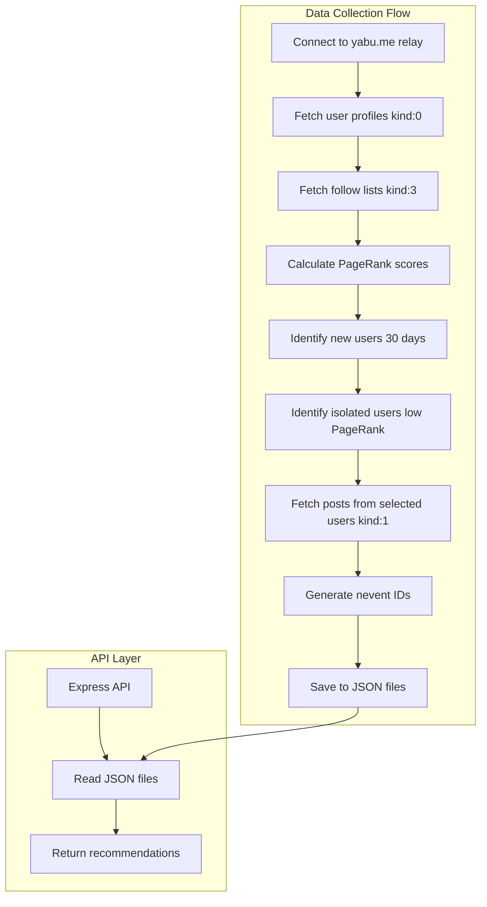

# Nostr-Tools Integration Implementation Plan

## 📋 Project Overview

**Objective**: Replace mock data in the Nostr recommendation API with real data from Nostr relays using nostr-tools.

**Target Relay**: `wss://yabu.me`

**Data Collection Goals**:
- 10 new users (created within 30 days)
- 10 isolated users (low PageRank score)
- Recent posts from selected users

## 🏗️ Architecture Overview



## 🔧 Implementation Steps

### Phase 1: Core Nostr Integration

#### 1.1 Update DataCollector with nostr-tools
- **File**: `src/collector.ts`
- **Changes**:
  - Import `SimplePool` from `nostr-tools/pool`
  - Import `nip19` for encoding/decoding pubkeys and event IDs
  - Add relay connection logic with proper error handling
  - Implement connection management and cleanup

```typescript
import { SimplePool } from 'nostr-tools/pool'
import { nip19 } from 'nostr-tools'

const RELAY_URL = 'wss://yabu.me'
const pool = new SimplePool()
```

#### 1.2 User Profile Collection
- **Functionality**: Fetch kind:0 events (user metadata)
- **Data Points**:
  - User pubkey (convert to npub format)
  - Profile creation timestamp
  - Name, about, picture (if available)
- **Storage**: Parse and validate profile data

#### 1.3 Follow Graph Analysis
- **Functionality**: Fetch kind:3 events (contact lists)
- **Purpose**: Build social graph for PageRank calculation
- **Data Structure**: Map of pubkey → following list

### Phase 2: User Classification Algorithms

#### 2.1 New User Detection
- **Criteria**: Profile created within last 30 days
- **Implementation**:
  ```typescript
  function isNewUser(createdAt: number): boolean {
    const thirtyDaysAgo = Date.now() - (30 * 24 * 60 * 60 * 1000);
    return createdAt * 1000 > thirtyDaysAgo; // Convert to milliseconds
  }
  ```
- **Selection**: Top 10 newest users
- **Reason**: 'new_user'

#### 2.2 Isolated User Detection (PageRank)
- **Algorithm**: Implement PageRank calculation
- **Implementation**:
  ```typescript
  interface PageRankNode {
    pubkey: string;
    followers: string[];
    following: string[];
    score: number;
  }

  function calculatePageRank(
    nodes: PageRankNode[],
    iterations: number = 10,
    dampingFactor: number = 0.85
  ): Map<string, number>
  ```
- **Selection**: 10 users with lowest PageRank scores
- **Reason**: 'isolated_user'

### Phase 3: Post Collection

#### 3.1 Post Retrieval
- **Target**: kind:1 events (text notes) from selected users
- **Time Window**: Last 7 days
- **Limit**: 3-5 recent posts per user
- **nevent Generation**: Use nip19 to create proper nevent IDs

#### 3.2 Data Association
- **Link posts to user classification reasons**:
  - Posts from new users → 'from_new_user'
  - Posts from isolated users → 'from_isolated_user'

### Phase 4: Enhanced Data Types

#### 4.1 Extended Type Definitions
```typescript
// Enhanced user type
interface NostrUserExtended extends NostrUser {
  name?: string;
  about?: string;
  picture?: string;
  pageRankScore?: number;
  relaySource: string;
  profileCreatedAt: number;
}

// Enhanced post type
interface NostrPostExtended extends NostrPost {
  content?: string;
  tags?: string[][];
  relaySource: string;
}
```

#### 4.2 Data Validation
- Validate pubkey formats
- Ensure nevent ID correctness
- Handle missing or malformed data gracefully

### Phase 5: Implementation Details

#### 5.1 Connection Management
```typescript
class NostrDataCollector {
  private pool: SimplePool;
  private relayUrl: string = 'wss://yabu.me';

  async connect(): Promise<void> {
    // Connection logic with timeout and retry
  }

  async disconnect(): Promise<void> {
    // Cleanup connections
  }
}
```

#### 5.2 Error Handling Strategy
- **Connection Failures**: Retry logic with exponential backoff
- **Data Parsing Errors**: Log and skip malformed events
- **Timeout Handling**: Set reasonable timeouts for relay operations
- **Graceful Degradation**: Continue with partial data if some operations fail

#### 5.3 Performance Optimizations
- **Batch Processing**: Process events in batches
- **Connection Pooling**: Reuse connections efficiently
- **Rate Limiting**: Respect relay rate limits
- **Caching**: Cache intermediate results during collection

### Phase 6: Testing & Validation

#### 6.1 Unit Tests
- Test PageRank calculation accuracy
- Validate user classification logic
- Test nevent ID generation
- Verify data parsing functions

#### 6.2 Integration Tests
- Test relay connectivity to yabu.me
- Validate end-to-end data collection flow
- Test API responses with real data
- Verify JSON file generation

#### 6.3 Data Quality Checks
- Ensure collected users meet criteria
- Validate post content and metadata
- Check for duplicate entries
- Verify timestamp accuracy

## 📊 Data Collection Configuration

### Collection Parameters
- **Relay**: `wss://yabu.me`
- **User Profile Limit**: 1000+ for analysis
- **New User Window**: 30 days
- **Post Time Window**: 7 days
- **Target Users**: 10 new + 10 isolated
- **Posts per User**: 3-5 recent posts

### PageRank Configuration
- **Iterations**: 10
- **Damping Factor**: 0.85
- **Convergence Threshold**: 0.001

## 🔄 Updated Data Flow

### Collection Process
1. **Initialize**: Connect to yabu.me relay
2. **Profile Collection**: Fetch kind:0 events for user metadata
3. **Graph Building**: Fetch kind:3 events for follow relationships
4. **Analysis**: Calculate PageRank scores and identify new users
5. **Selection**: Choose 10 new and 10 isolated users
6. **Post Collection**: Fetch recent kind:1 events from selected users
7. **Storage**: Generate JSON files with real Nostr data

### Enhanced JSON Structure
```json
{
  "recommendedUsers": [
    {
      "pubkey": "npub1real...",
      "reason": "new_user",
      "createdAt": "2025-05-15T10:00:00Z",
      "name": "Real User Name",
      "pageRankScore": 0.001,
      "relaySource": "wss://yabu.me"
    }
  ],
  "metadata": {
    "lastUpdated": "2025-06-03T12:00:00Z",
    "totalAnalyzed": 1000,
    "relaySource": "wss://yabu.me",
    "collectionDuration": "45s"
  }
}
```

## 🛠️ Error Handling & Resilience

### Connection Resilience
- **Timeout Handling**: 30-second timeout for relay operations
- **Retry Logic**: 3 attempts with exponential backoff
- **Fallback Strategy**: Continue with partial data if relay becomes unavailable

### Data Validation
- **Pubkey Validation**: Ensure valid hex format before nip19 encoding
- **Event Validation**: Check required fields and signatures
- **Content Filtering**: Basic content validation and sanitization

### Logging Strategy
- **Progress Logging**: Track collection progress and statistics
- **Error Logging**: Detailed error information for debugging
- **Performance Metrics**: Collection time and success rates

## 📈 Success Criteria

### Technical Success
- [ ] Successfully connect to wss://yabu.me relay
- [ ] Collect 1000+ user profiles for analysis
- [ ] Implement accurate PageRank calculation
- [ ] Identify 10 new users (created within 30 days)
- [ ] Identify 10 isolated users (lowest PageRank scores)
- [ ] Collect recent posts from selected users
- [ ] Generate valid nevent IDs for all posts
- [ ] Maintain API compatibility with existing clients

### Data Quality Success
- [ ] All collected pubkeys are valid and properly formatted
- [ ] User classification criteria are correctly applied
- [ ] Post content is relevant and recent
- [ ] JSON files are properly structured and valid
- [ ] API responses contain real Nostr data

### Performance Success
- [ ] Data collection completes within 2 minutes
- [ ] Memory usage remains reasonable during collection
- [ ] API response times remain under 100ms
- [ ] No memory leaks or connection issues

## 🚀 Deployment Strategy

### Development Phase
1. Implement core nostr-tools integration
2. Test with small data sets
3. Validate PageRank algorithm
4. Test API responses

### Testing Phase
1. Full integration testing with yabu.me
2. Performance testing with larger datasets
3. Error handling validation
4. API compatibility testing

### Production Deployment
1. Deploy updated collector
2. Run initial data collection
3. Verify API responses
4. Monitor performance and errors

## 📝 Implementation Checklist

### Core Implementation
- [ ] Update package.json dependencies
- [ ] Implement NostrDataCollector class
- [ ] Add relay connection management
- [ ] Implement user profile collection
- [ ] Build follow graph analysis
- [ ] Implement PageRank algorithm
- [ ] Add user classification logic
- [ ] Implement post collection
- [ ] Add nevent ID generation
- [ ] Update JSON file structure

### Testing & Validation
- [ ] Unit tests for core functions
- [ ] Integration tests with relay
- [ ] API response validation
- [ ] Error handling tests
- [ ] Performance benchmarks

### Documentation & Deployment
- [ ] Update README with new features
- [ ] Document API changes
- [ ] Update DESIGN.md
- [ ] Deploy and monitor

---

This implementation plan provides a comprehensive roadmap for integrating nostr-tools and replacing mock data with real Nostr data from the yabu.me relay.
