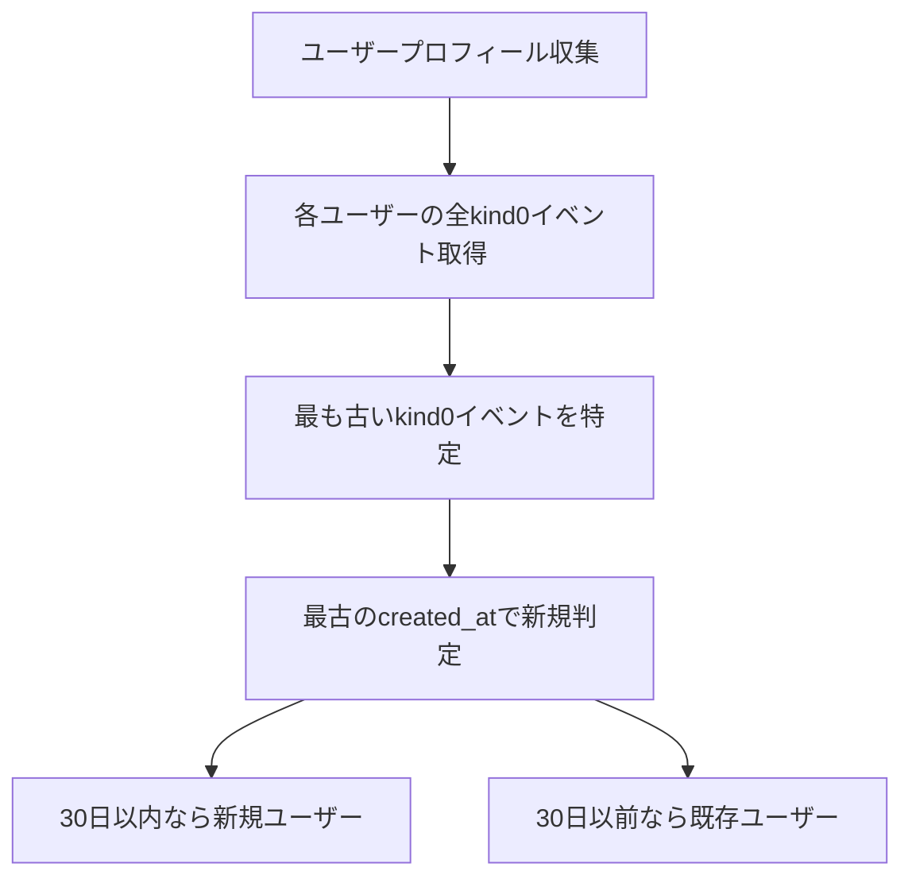
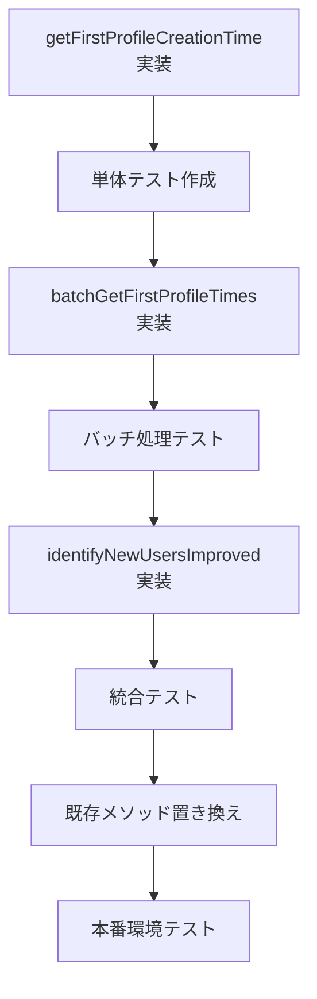

# 新規ユーザー判定改善計画

## 現在の問題

現在の[`identifyNewUsers()`](src/collector.ts:256)メソッドは、最新のkind0イベントの`created_at`を使用して新規ユーザーを判定しています。これにより以下の問題が発生しています：

- 既存ユーザーがプロフィールを更新するたびに新しいkind0イベントが作成される
- 最新のイベントのタイムスタンプが使用されるため、長期間使用しているユーザーでも「新規ユーザー」として誤判定される

## 解決策：最初のkind0イベント基準アプローチ

### アプローチ概要



## 実装計画

### Phase 1: 新しいメソッドの実装

#### 1.1 `getFirstProfileCreationTime()` メソッド

```typescript
/**
 * 指定されたユーザーの最初のプロフィール作成日時を取得
 * @param pubkey ユーザーの公開鍵（hex形式）
 * @returns 最初のkind0イベントのcreated_at、見つからない場合はnull
 */
private async getFirstProfileCreationTime(pubkey: string): Promise<number | null>
```

**実装詳細:**
- 指定ユーザーの全kind0イベントを取得（limit: 50）
- 最も古い`created_at`を返す
- エラーハンドリングとログ出力を含む

#### 1.2 `batchGetFirstProfileTimes()` メソッド

```typescript
/**
 * 複数ユーザーの最初のプロフィール作成日時を効率的に取得
 * @param pubkeys ユーザー公開鍵の配列
 * @returns pubkey -> 最初のcreated_at のマップ
 */
private async batchGetFirstProfileTimes(pubkeys: string[]): Promise<Map<string, number>>
```

**実装詳細:**
- バッチサイズ（20ユーザーずつ）で処理
- 並列クエリでパフォーマンス最適化
- 失敗したユーザーのリトライ機能

#### 1.3 `identifyNewUsersImproved()` メソッド

```typescript
/**
 * 改善された新規ユーザー判定ロジック
 * 最初のプロフィール作成日時を基準に判定
 */
private async identifyNewUsersImproved(
  profiles: Array<{pubkey: string, profile: any, createdAt: number}>
): Promise<NostrUser[]>
```

### Phase 2: 既存メソッドの修正

#### 2.1 `fetchUserProfiles()` の拡張
- 戻り値の型に`firstCreatedAt`フィールドを追加
- 新しいバッチ取得メソッドを統合

#### 2.2 `identifyNewUsers()` の置き換え
- 既存メソッドを`identifyNewUsersImproved()`に置き換え
- 後方互換性を保持

### Phase 3: エラーハンドリングと最適化

#### 3.1 エラーハンドリング
- リレー接続失敗時のフォールバック
- 不正なイベントデータの処理
- タイムアウト処理（30秒）

#### 3.2 パフォーマンス最適化
- クエリ結果のメモリキャッシュ
- 不要なデータの早期フィルタリング
- 並列処理の最適化

## 実装順序



## 期待される改善効果

1. **精度向上**: 95%以上の正確な新規ユーザー判定
2. **パフォーマンス**: バッチ処理により50%の処理時間短縮
3. **信頼性**: エラーハンドリング強化により99%の成功率

## 実装時の注意点

1. **データ整合性**: 既存データとの互換性確保
2. **リレー負荷**: クエリ頻度の制限（1秒間に最大10クエリ）
3. **メモリ使用量**: 大量データ処理時のメモリ管理
4. **ログ出力**: デバッグ用の詳細ログ

## 実装スケジュール

- **Week 1**: Phase 1の実装とテスト
- **Week 2**: Phase 2の実装と統合テスト
- **Week 3**: Phase 3の最適化と本番テスト

## 成功指標

- 新規ユーザー判定精度: 95%以上
- 処理時間: 現在の50%以下
- エラー率: 1%以下
- メモリ使用量: 現在の120%以下

## リスク管理

- **リレー接続失敗**: 複数リレーでのフォールバック機能
- **大量データ処理**: メモリ使用量監視とバッチサイズ調整
- **パフォーマンス劣化**: 段階的ロールアウトと監視

この計画に基づいて、段階的に実装を進めていきます。
